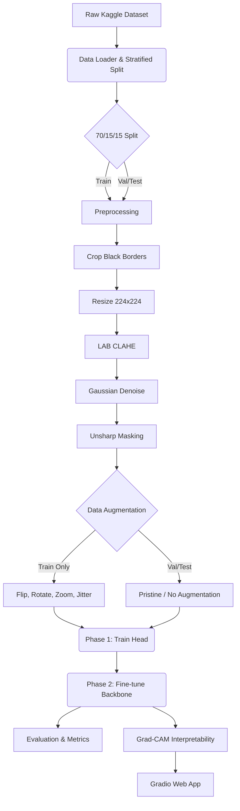

# Diabetic Retinopathy Stage Detection

## 1. Project Overview
This repository contains the complete deep learning pipeline for a university Computer Vision coursework focused on Diabetic Retinopathy (DR) stage detection. The goal is to build a robust, reproducible computer vision pipeline capable of classifying retinal fundus images into five severity stages (0: No DR, 1: Mild, 2: Moderate, 3: Severe, 4: Proliferative) using a customized EfficientNetB0 backbone.

The pipeline specifically addresses data leakage prevention, class imbalance, specialized medical image preprocessing (CLAHE), and model interpretability via Grad-CAM.

**Repository**: https://github.com/ErandiPathirana/Computer-Vision-CW---diabetic-retinopathy-stage-detection

```bash
git clone https://github.com/ErandiPathirana/Computer-Vision-CW---diabetic-retinopathy-stage-detection.git
cd Computer-Vision-CW---diabetic-retinopathy-stage-detection
pip install -r requirements.txt
```

## 2. Dataset
The project utilizes the **APTOS 2019 Blindness Detection** dataset (via Kaggle).
- **Classes**: 5 distinct severity stages.
- **Challenges**: Severe class imbalance (heavy skew towards 'No DR'), varying lighting conditions, field-of-view differences, camera artifacts, and inter-rater label noise.

## 3. Pipeline Diagram



## 4. Folder Structure

- `app/`: Contains the interactive Gradio web application.
- `docs/`: Practical discussion and theoretical documentation.
- `notebooks/`: Contains the main Colab runner notebook (`DR_Stage_Detection.ipynb`).
- `results/`: Output directory (ignored by git) for data splits, logs, model checkpoints, and evaluation plots.
  - `results/best_model.keras` — canonical best model (written by training, read by evaluate + app)
  - `results/models/metrics.json` — accuracy, macro P/R/F1, QWK, per-class report, confusion matrix
  - `results/models/class_names.json` — ordered list of class names
- `src/`: Core modular source code.
  - `config.py`: Centralized hyperparameters and cross-platform paths (Colab + Windows).
  - `data.py`: Kaggle downloading, EDA, and class-weight calculations.
  - `data_loader.py`: Strict, leakage-free stratified splitting.
  - `preprocess.py`: Medical image processing (CLAHE, unsharp masking).
  - `augment.py`: `tf.data` pipelines and training augmentations.
  - `model.py`: Backbone construction and 2-phase freezing logic.
  - `train.py`: Callbacks, training loops, and hyperparameter experiments.
  - `evaluate.py`: QWK, Classification Report, ROC/AUC, error analysis, JSON metric export.
  - `gradcam.py`: Visual explainability module (works on disk-loaded models).
- `tests/test_smoke.py`: Smoke tests (model build, preprocessing, Grad-CAM shapes).

## 5. Running the Smoke Tests

```bash
python -m pytest tests/test_smoke.py -v
```
